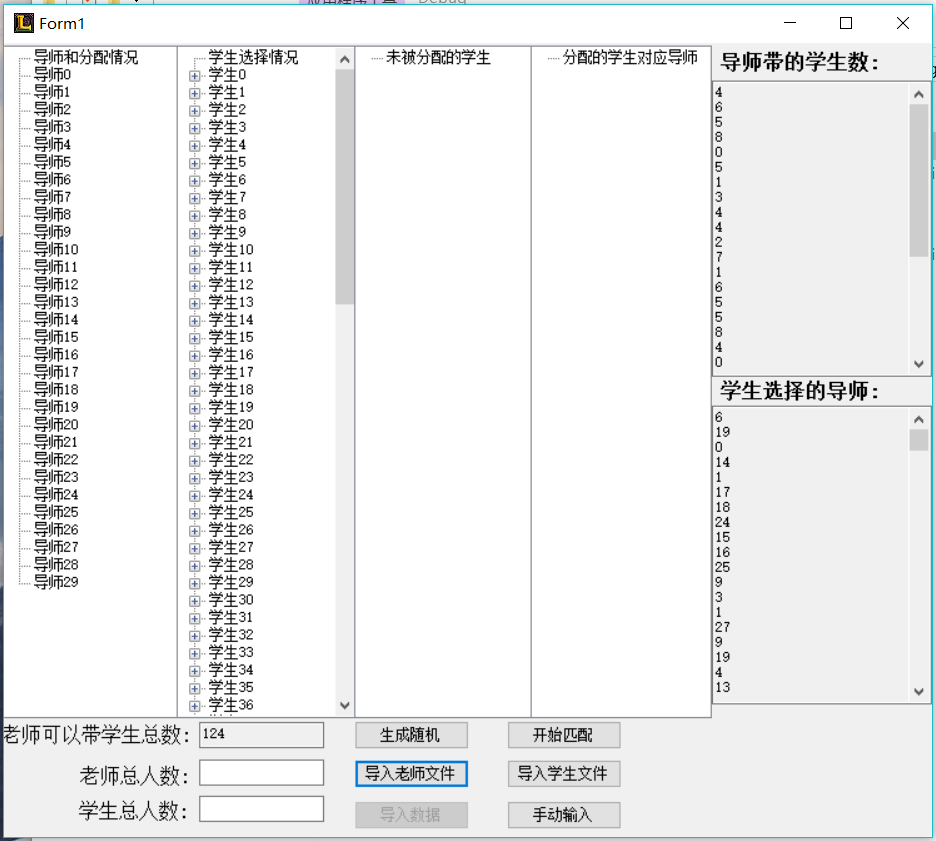
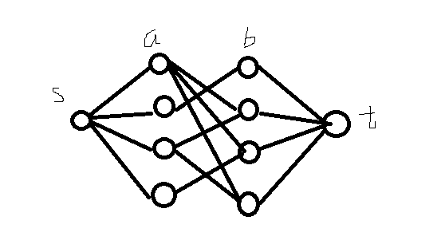

# STmatch

## cShrp版

因为有图形界面，所以
使用方法，参看下图：



## python版

使用方法

```python
#30个导师和100个学生之间的配对
python match.py -s 100 -t 30
```

## 关于最小费用流算法的应用
- 学生集合a，导师集合b
- 以集合a和集合b建立二部图
- a一侧连接源点s，b一侧连接汇点t
- 边权定义为 w=5-ai.score

建立网络：



参考资料：

[1.网络流入门](https://comzyh.com/blog/archives/568/)

[2.有最大费用流吗](https://www.zhihu.com/question/27975043)

